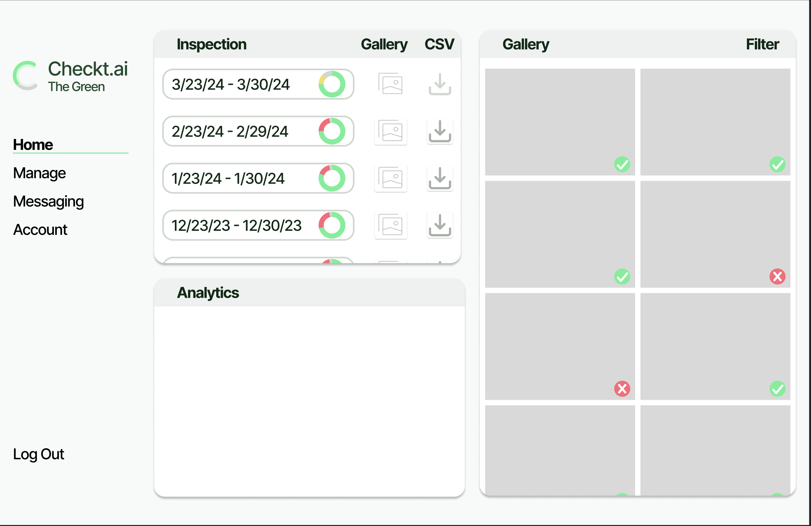
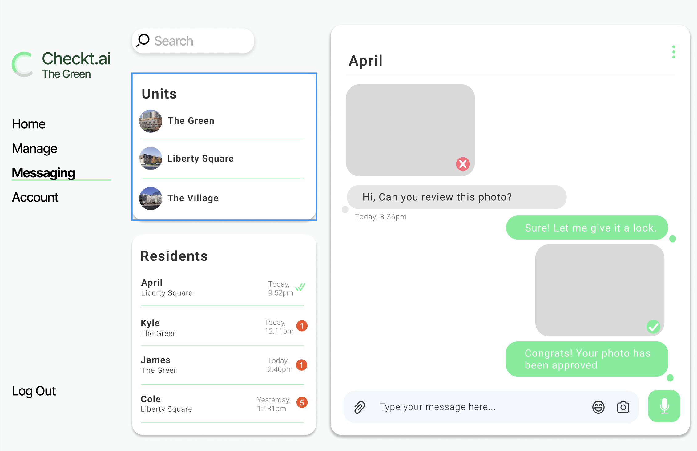

To my dear T.A,
I have ADHD and am in ACME, I don't think online classes are my cup of tea haha. I do not envy your position right now. I've tried to format this screen to make it easier for you to grade through this quickly!

# Checkt.ai

## Specification Deliverable
### Elevator pitch

Cleaning Checks are just simply the worst - for everyone. Residents definitely do not like strangers walking into their room while they sleep or last-minute checks scheduled while their whole apartment is out of town (happened to me). Add on how inconsistent inspectors are and you see the nightmare.

Property managers do not like them either. Headache of planning and executing hundreds of separate inspections is just not worth it.

Checkt.ai is a novel ai-powered technology that allows residents to see their cleaning assingments and upload their own photos of the apartment. Ai image-recognition technology then automatically passes or fails the cleaning check. Checkt.ai is a reliable, easy, private, and consistent solution to this pain.

### Design

#### Login screen

#### Main dashboard for Property Manager

#### Resident application for uploading photos

#### Messages screen

#### The entire tech stack

### Key Features
• Secure login/create account over HTTPS

• Create new cleaning check assingments

• Edit the residents and units

• View and filter images on dashboard stored in S3 Bucket

• Download information about the cleaning check as a csv file

• Message residents and pass-off cleaning checks

• View analytics on the progress and results of a cleaning check

### Technologies
I use the technologies in the following ways:

• HTML - HTML pages for login, main dashboard, messaging page

• CSS - Application styling for different size screens, color and format components, create scrollable elements and add shadows and items only visible on hover

• JavaScript - Used to expand gallery, filter images, download inspection information, detailed analytics, backend calls and fetches

• Service - Backend service for:

  - Login
  
  - Create account
  
  - Add/remove unit
  
  - Add inspection

  - Add/remove resident
  
  - Override inspection result
  
  - Analyze photo (Google's API)
  
  - Get photos and inspection data

• DB/Login - Authorize user, store photos in S3 and photo urls in DB, units and residents, inspection result, need authorization to upload photos, store messages

• WebSocket - Message residents

• React - Port the entire project to React
